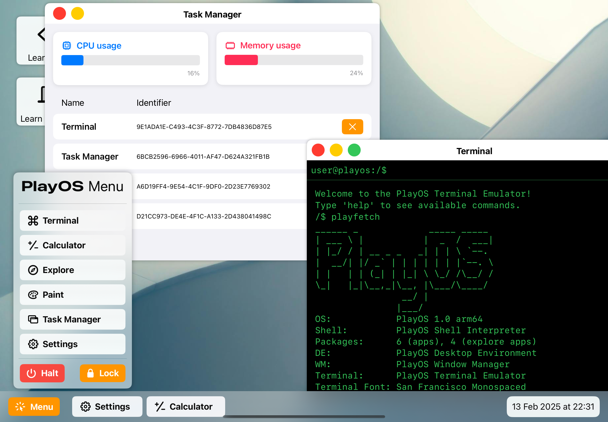

# PlayOS

  
Welcome to the official repository for <strong>PlayOS</strong> Your interactive SwiftUI desktop simulation for learning essential computing concepts.

  

## About PlayOS

PlayOS is an interactive SwiftUI desktop simulation designed to help younger generations grasp essential computing concepts in a safe, sandboxed environment. Users can explore coding challenges, quizzes, and simulations like a Terminal or Task Manager, fostering deeper digital literacy through engaging, hands-on activities.

> [!TIP]
> **Key Features**:
> - Coding challenges and quizzes to test and develop computing skills.  
> - Simulated terminal and task manager to introduce core OS interactions.  
> - Fully sandboxed environment for offline, secure exploration.  
> - A multi-window desktop interface built with SwiftUI and carefully adapted for touch-based devices like iPad.

## Bundled Web Applications

PlayOS takes advantage of the WebKit framework to run a series of **offline**, locally hosted web applications. These HTML files are fully integrated into the Swift Playground, delivering a desktop-like experience without requiring an internet connection. The open source web apps included are:

- **ExploreHome.html**: A homepage simulating a web environment.  
- **CodingChallenge.html**: An interactive code editor and interpreter for practicing coding skills.  
- **ComputerQuiz.html**: A short quiz to self-evaluate computing knowledge.  
- **SnakeGame.html**: A mini Snake game for a fun break.  
- **TicTacToe.html**: A basic Tic Tac Toe game.

All HTML files are licensed with open source terms embedded directly in their contents. This approach demonstrates how drop-in web apps can expand SwiftUI’s capabilities, offering a more realistic desktop simulation.

## Customization and Assets

To enhance the realism of a desktop environment, PlayOS bundles a set of:

- **Wallpaper images**  
- **User-profile pictures**  

These assets are sourced from online picture sharing platforms under permissible usage terms. Users can customize their wallpaper and profile picture, mirroring the personalization features of a real operating system.

## Touch-Optimized Desktop Experience

While PlayOS mimics a traditional multi-window desktop, it is also carefully optimized for touch devices like iPad. UI elements are enlarged for easy tapping, and specialized gestures ensure windows can be dragged and resized in a natural way. SwiftUI's animation system brings the illusion of opening, closing, and moving windows smoothly around the screen.

> [!NOTE]
> **SwiftUI** was chosen for its declarative approach and powerful animations, allowing a fluid user experience without extensive boilerplate. With SwiftUI, the project can focus on delivering an intuitive “desktop” environment that remains responsive and visually engaging on touch-based hardware.

## Offline Web Integration

By leveraging **WebKit**, PlayOS incorporates an offline browsing experience for the bundled apps. This design choice preserves the sense of “discovering and exploring” different apps—just like on a real desktop—while maintaining the sandboxed nature of Swift Playgrounds. Users can experiment, learn, and play entirely offline, ensuring a safe environment for educational purposes.

## Minimum Requirements

> [!WARNING]
> **Recommended Setup**:
> - **Device**: iPad (or Mac) capable of running Swift Playgrounds  
> - **Operating System**: iPadOS or macOS with Swift Playgrounds installed

PlayOS is primarily tested on iPads to ensure the best touch-based interaction experience.
